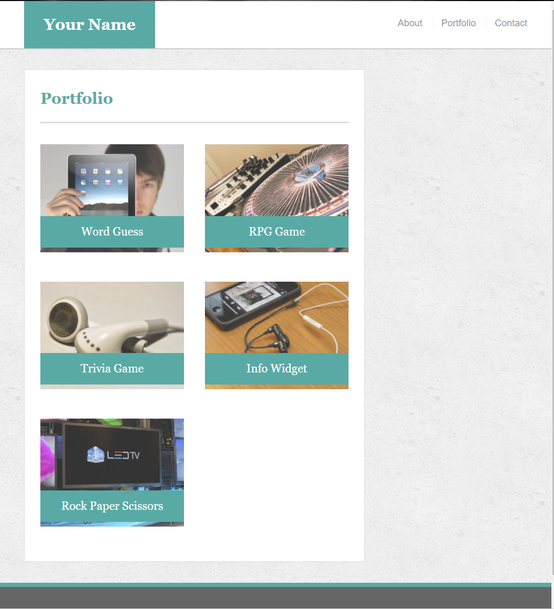

[Application]()

# Purpose

The purpose of this exercise was to recreate the first [portfolio](https://github.com/Cragady/Cragady.github.io), using mostly css and media queries for a responsive design; no bootstrap.

# Guidelines

Pictures were given to specify the layout at certain widths for the portfolio.

## @980px

<kbd></kbd>

<kbd></kbd>

<kbd></kbd>

## @768px

<kbd></kbd>

<kbd></kbd>

<kbd></kbd>

## @640px

<kbd></kbd>

<kbd></kbd>

<kbd></kbd>